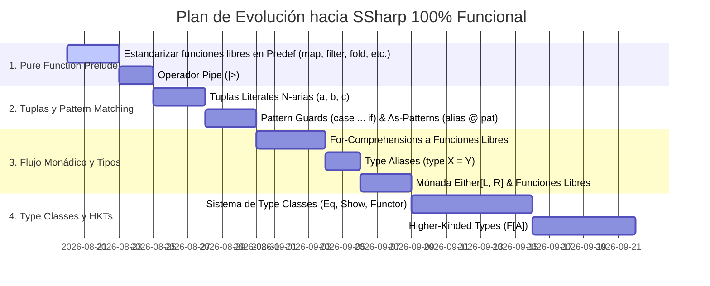

# SSharp — Roadmap hacia un Lenguaje 100% Funcional Puro (TODO)

## 🌿 Filosofía de Diseño: *Pure Functions & Data First*

A diferencia de los lenguajes híbridos orientados a objetos (como Scala o C#), la visión de **SSharp** es ser un lenguaje **puramente funcional** (en la tradición de **Haskell, Elm, OCaml y Clojure**):

1. **Sin métodos orientados a objetos (`xs.method()`)**: No existen métodos de instancia adjuntos a objetos. Los datos son estructuras inmutables pasivas (ADTs, records, tuplas) y las operaciones son **funciones libres puras**:
   - ❌ *No orientado a objetos*: `xs.map(f)`, `xs.filter(p)`, `xs.size`, `p.copy(x = 1)`
   - ✅ *100% Funcional*: `map(f, xs)`, `filter(p, xs)`, `size(xs)` (o `length(xs)`), `updatePoint(p, 1, p.y)`
2. **Composición y Flujo con Operador Pipe (`|>`)**: Para encadenar transformaciones de datos sin anidamiento excesivo ni métodos OO:
   ```ssharp
   val resultado = xs
       |> filter(isEven)
       |> map(doubleIt)
       |> take(5)
   ```
3. **Transparencia Referencial**: Todas las funciones son deterministas y libres de efectos secundarios ocultos.

---

## 📊 Matriz Comparativa: Haskell vs. SSharp (Ruta hacia Pureza Total)

| Característica | Haskell | SSharp Actual | Meta en SSharp Puro | Estado |
| :--- | :---: | :---: | :---: | :---: |
| **Paradigma** | 100% Funcional | Híbrido (funciones + métodos en runtime) | **100% Funciones Libres** | 🔄 En migración |
| **Invocación de Operaciones** | `map f xs`, `length xs` | `xs.map(f)`, `xs.size` | `map(f, xs)`, `length(xs)` | **Prioridad 1** |
| **Operador Pipe (`\|>`)** | `&` (Data.Function) | ❌ No disponible | `xs \|> f \|> g` | **Prioridad 1** |
| **Tuplas de Aridad N** | `(a, b, c, ...)` | Solo `Tuple2(a, b)` | `(a, b, c, ...)` nativo | **Prioridad 1** |
| **Pattern Guards & As-Patterns** | `f x \| x > 0`, `xs@(x:rest)` | ❌ No disponible | `case x if x > 0 =>`, `case xs @ (h :: t) =>` | **Prioridad 1** |
| **List / Monad Comprehensions** | `[x*2 \| x <- xs, x > 0]` | ❌ No disponible | `[f(x) \| x <- xs, cond(x)]` | **Prioridad 2** |
| **Do-Notation / For-Comprehensions** | `do { x <- mx; return (x+1) }` | ❌ No disponible | `for { x <- xs } yield ...` (desugared to pure `flatMap`/`map`) | **Prioridad 2** |
| **Prelude Funcional Extendido** | `foldr`, `foldl`, `zipWith`, etc. | Métodos limitados en List/Option | Módulo `Predef` completo con funciones libres | **Prioridad 2** |
| **Type Aliases (`type`)** | `type Point = (Int, Int)` | ❌ No disponible | `type Point = (Int, Int)` | **Prioridad 2** |
| **Type Classes** (`Eq`, `Show`, `Functor`, `Monad`) | `class Functor f where ...` | ❌ No disponible | `trait Functor[F[_]]` + resolución de instancias | **Prioridad 3** |
| **Higher-Kinded Types (HKTs)** | `f a` donde `f :: * -> *` | ❌ Solo tipos de orden 1 | Constructores de tipo `F[A]` de orden superior | **Prioridad 3** |
| **Streams / LazyList Infinitos** | `[1..]`, `take 5 (repeat 1)` | ❌ Listas finitas | `Stream.from(1)`, `take(5, stream)` | **Prioridad 3** |

---

## 🎯 Especificación de Características y Transformaciones

### 1. Migración a Funciones Libres en el Prelude (`Predef`)
Eliminar la dependencia de invocar métodos OO (`.map`, `.filter`, `.size`, `.contains`) y sustituirlos por funciones libres de orden superior en el Prelude:

```ssharp
// En lugar de: nums.filter(isEven).map(double)
// Forma funcional pura:
val evens = filter(isEven, nums)
val doubled = map((x: Int) => x * 2, evens)
val len = length(nums)
val hasTen = contains(10, nums)
```

**Funciones a estandarizar en el Prelude**:
- **Inspección**: `length(xs)`, `isEmpty(xs)`, `head(xs)`, `tail(xs)`, `contains(x, xs)`
- **Transformación**: `map(f, xs)`, `filter(p, xs)`, `flatMap(f, xs)`, `reverse(xs)`, `concat(xs, ys)`
- **Reducción**: `foldl(z, f, xs)`, `foldr(z, f, xs)`, `sum(xs)`, `product(xs)`, `reduce(f, xs)`
- **Subconjuntos**: `take(n, xs)`, `drop(n, xs)`, `takeWhile(p, xs)`, `dropWhile(p, xs)`
- **Combinación**: `zip(xs, ys)`, `zipWith(f, xs, ys)`

---

### 2. Operador Pipe (`|>`)
Permite leer el flujo de transformación de izquierda a derecha (hacia adelante), fundamental en lenguajes puramente funcionales:

```ssharp
// x |> f  equivale a  f(x)
val resultado = List(1, 2, 3, 4, 5, 6)
    |> filter(isEven)
    |> map((x: Int) => x * 10)
    |> sum
```

---

### 3. Tuplas Literales N-arias (`Tuple2` - `Tuple8`)
Sintaxis literal para empaquetar datos heterogéneos sin crear clases nominales:

```ssharp
val persona: (String, Int, Boolean) = ("Alice", 25, true)

// Deconstrucción en funciones / pattern matching:
def format(t: (String, Int)): String = t match {
    case (nombre, edad) => nombre + " tiene " + edad + " años"
}
```

---

### 4. Pattern Matching con Guards y As-Patterns
Control de patrones más expresivo sin anidar condicionales en el cuerpo:

```ssharp
def evaluar(n: Int): String = n match {
    case x if x < 0 => "Negativo"
    case 0 => "Cero"
    case x if x % 2 == 0 => "Positivo par"
    case _ => "Positivo impar"
}

// As-Patterns (@) para ligar el todo y sus partes:
def duplicateHead(l: List[Int]): List[Int] = l match {
    case Nil => Nil
    case original @ (h :: _) => h :: original
}
```

---

### 5. For-Comprehensions Desugareadas a Funciones Libres
Las comprensiones monádicas se desugarean directamente a llamadas a las funciones libres `flatMap`, `map` y `filter`:

```ssharp
val pares = for {
    x <- List(1, 2, 3)
    y <- List(10, 20)
    if x + y > 15
} yield x + y

// Desugaring puro:
// flatMap((x: Int) => 
//     flatMap((y: Int) => 
//         map((_: Unit) => x + y, filter((_: Unit) => x + y > 15, List(Unit)))
//     , List(10, 20))
// , List(1, 2, 3))
```

---

### 6. Type Aliases (`type`)
Definir sinónimos de tipos para simplificar código funcional de orden superior:

```ssharp
type Predicate[A] = A => Boolean
type Transform[A, B] = A => B
type Point = (Double, Double)
```

---

### 7. Tipos Mónada Puros en Runtime (`Either`, `Option`, `State`)
- `Option[A]`: `Some(v)` y `None` con funciones libres `isSome(opt)`, `getOrElse(default, opt)`, `mapOption(f, opt)`.
- `Either[L, R]`: `Left(err)` y `Right(val)` para manejo puro de errores sin excepciones.

---

## 🗺️ Plan de Implementación (Roadmap)



---

### Tareas Detalladas por Componente

#### 📦 1. `SSharp.Runtime` (Prelude Funcional)
- [ ] Implementar en `Predef.cs` las funciones libres de orden superior:
  - `map<T, U>(Func<T, U> f, SSharpList<T> xs)`
  - `filter<T>(Func<T, bool> p, SSharpList<T> xs)`
  - `flatMap<T, U>(Func<T, SSharpList<U>> f, SSharpList<T> xs)`
  - `foldLeft<T, U>(U z, Func<U, T, U> f, SSharpList<T> xs)`
  - `foldRight<T, U>(U z, Func<T, U, U> f, SSharpList<T> xs)`
  - `length<T>(SSharpList<T> xs)`, `size<T>(SSharpList<T> xs)`
  - `isEmpty<T>(SSharpList<T> xs)`
  - `take<T>(int n, SSharpList<T> xs)`, `drop<T>(int n, SSharpList<T> xs)`
  - `zip<A, B>(SSharpList<A> xs, SSharpList<B> ys)`
  - `zipWith<A, B, C>(Func<A, B, C> f, SSharpList<A> xs, SSharpList<B> ys)`
  - `contains<T>(T elem, SSharpList<T> xs)`
  - `reverse<T>(SSharpList<T> xs)`
- [ ] Implementar `Tuple3.cs` hasta `Tuple8.cs` y sus funciones constructoras `Tuple3(a, b, c)`.
- [ ] Implementar `Either.cs` (`Left<L, R>`, `Right<L, R>`) con funciones libres `isLeft`, `isRight`, `mapEither`.

#### 🔍 2. `SSharp.Compiler` (Parser & Lexer)
- [ ] **Lexer**:
  - Agregar token `Pipe` (`|>`).
  - Agregar token `At` (`@`).
  - Agregar token `For` y `Yield`.
  - Agregar token `TypeAlias` (`type`).
- [ ] **Parser**:
  - Expresión Pipe: `lhs |> rhs` (asociativa por la izquierda).
  - Tuplas literales: `(a, b, c)` en `ParsePrefix`.
  - Pattern Guards: `case pattern if cond => body` en `ParseMatchCase`.
  - As-Patterns: `name @ pattern` en `ParsePattern`.
  - Type Aliases: `type Name[T] = TargetType;`.
  - For-Comprehensions: `for { x <- xs; if cond } yield expr`.

#### 🧠 3. `SSharp.Compiler` (TypeChecker)
- [ ] Registrar todas las funciones libres del Prelude en el entorno inicial `_env`.
- [ ] Tipar la expresión `a |> f` como la aplicación de función `f(a)`.
- [ ] Tipar tuplas `(a, b, c)` como `GenericType("TupleN", [Ta, Tb, Tc])`.
- [ ] Validar guards booleanos en pattern matching en el scope de las variables ligadas.
- [ ] Expandir Type Aliases transparentemente durante `ResolveType`.

#### ⚡ 4. `SSharp.Compiler` (CodeGenerator)
- [ ] Traducir `a |> f` a llamada directa de función `f(a)` en C#.
- [ ] Traducir tuplas literales `(a, b)` a `new SSharp.Runtime.SSharpTupleN<...>(...)`.
- [ ] Traducir pattern guards a cláusulas `when (cond)` en switch expressions de C#.
- [ ] Traducir for-comprehensions desugareadas a llamadas de funciones libres `flatMap` y `map`.

#### 🧪 5. `SSharp.Spec` (Casos de Especificación)
- [ ] `048_predef_free_functions`: Validar `map`, `filter`, `length`, `foldLeft` como funciones libres.
- [ ] `049_pipe_operator`: Validar cadenas de transformación `xs |> filter(...) |> map(...)`.
- [ ] `050_tuple_literals_and_matching`: Validar tuplas de aridad 3 y 4 con pattern matching.
- [ ] `051_pattern_guards`: Validar pattern matching con guards condicionales `if`.
- [ ] `052_as_patterns`: Validar enlace simultáneo del todo y las partes con `@`.
- [ ] `053_for_comprehensions`: Validar comprensiones con generadores y filtros.
- [ ] `054_type_aliases`: Validar sinónimos de tipos para funciones y tuplas.
- [ ] `055_either_monad_free_functions`: Validar `Either` con funciones puras `mapEither`, `getOrElse`.
